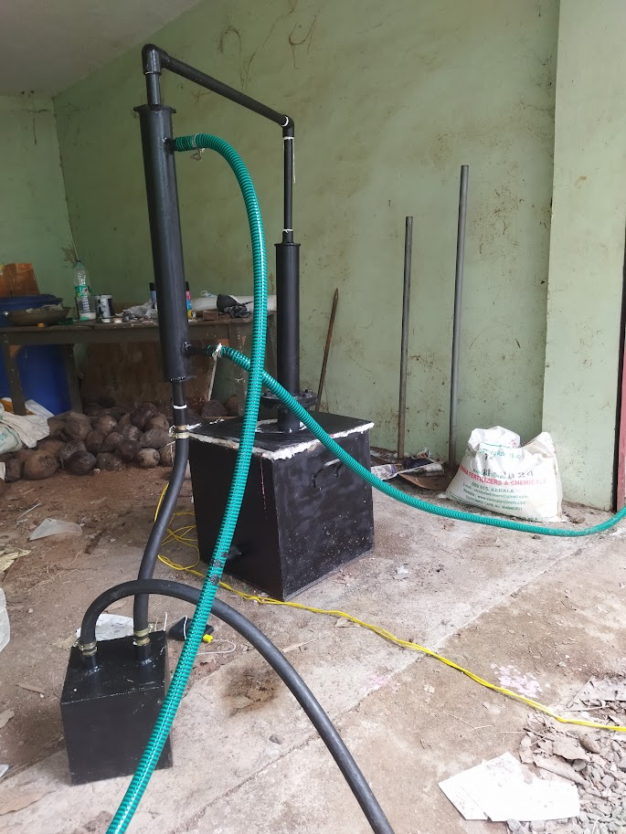
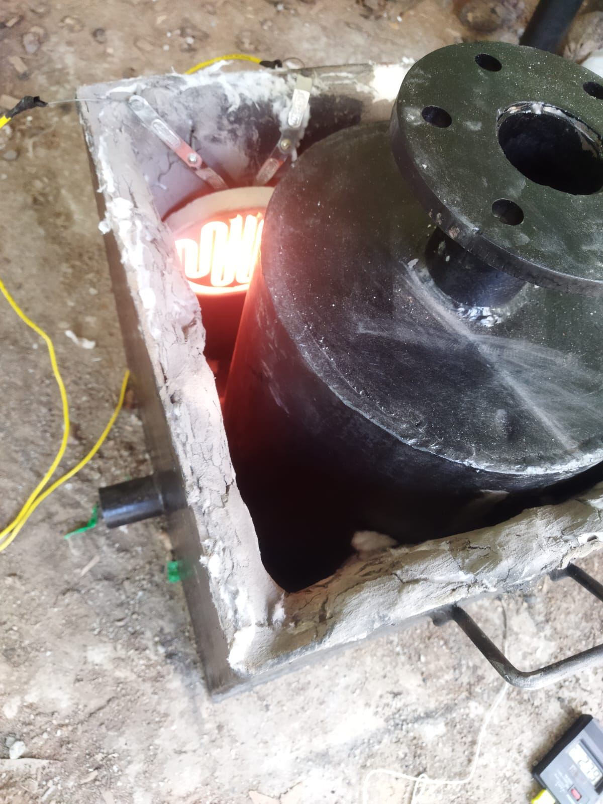

# Plastic Pyrolysis Reactor 


A lab-scale plastic pyrolysis reactor designed and fabricated for converting mixed plastic waste into pyrolysis oil, syngas, and carbon black through controlled thermal decomposition in an oxygen-free environment. Originated as a feasible entry point toward a longer-term methane pyrolysis concept (biogas → green hydrogen + sequestered solid carbon).

---

## Overview

Kerala generates ~600 tonnes of plastic waste per day, of which only ~20% is collected for processing. Multi-layer plastics, LDPE bags, and polystyrene containers cannot be mechanically recycled. Pyrolysis offers a thermal decomposition path that recovers fuel-equivalent products from feedstock that would otherwise reach landfill or incineration.

The project was developed under the working name **Neuflow Energy** and incubated at:

- **CSIR-NIIST** — Council of Scientific and Industrial Research, Govt. of India
- **Maker Village** — Ministry of Electronics, Govt. of India

---

## Origin

The original concept was **methane pyrolysis** — converting biogas-derived methane into green hydrogen and solid carbon, providing clean fuel and permanent carbon sequestration in one process. The required quartz reactor, controlled microwave heating, inert gas handling, and hydrogen analysers were beyond independent build capability at that stage.

Plastic pyrolysis was selected as a feasible entry point to build real fabrication and process engineering experience with pyrolysis at lower complexity. The knowledge transfer to methane pyrolysis remains the longer-term direction.

---

## Highlights

- **7 kg batch capacity** lab-scale reactor designed and fabricated from first principles
- PID-controlled resistive heating, **400–500 °C** optimal pyrolysis range
- **Water-cooled double-pipe condenser** for liquid oil recovery (counter-flow, 2" / 1" pipes)
- Demonstrated flammable gaseous fraction recovery
- Partial liquid oil collection achieved
- Incubated at CSIR-NIIST and Maker Village (Govt. of India)
- Presented at Vruthi Conclave 2025

---

## Feedstock & Energy Balance

### Feedstock Composition

Typical feedstock composition assumed for mixed municipal plastic waste:

| Plastic Type | Fraction | Pyrolysis Temp Range |
|---|---|---|
| LDPE (bags, film) | ~50% | 350–500 °C |
| PP (containers, fibre) | ~30% | 350–450 °C |
| PS (cups, foam) | ~20% | 300–400 °C |

Target operating temperature: **450 °C** (mid-range, covers all three fractions)

### Energy Required per Batch

| Component | Calculation | Energy |
|---|---|---|
| Sensible heating of plastic | 7 kg × 2.0 kJ/kg·K × (450 − 25)°C | **5,950 kJ** |
| Endothermic pyrolysis heat | 7 kg × 1,600 kJ/kg (LDPE/PP average) | **11,200 kJ** |
| Subtotal (ideal) | | **17,150 kJ** |
| With ~20% insulation losses | | **~20,600 kJ ≈ 5.7 kWh** |

### Expected Product Yield (7 kg batch)

Based on published pyrolysis yield data for LDPE/PP/PS mixed feedstock:

| Product | Yield | Mass |
|---|---|---|
| Liquid oil (fuel-equivalent) | 50% | **3.5 kg** |
| Non-condensable gas (syngas) | 25% | **1.75 kg** |
| Char / carbon black | 25% | **1.75 kg** |

---

## Reactor Thermal Design

### Heating Coil Sizing

```
Target operating temperature:  450–500 °C
Heating element surface temp:  ~550 °C (for adequate heat flux)
Heater power selected:         1.5 kW (resistive coil)

Heating phase (ambient → 450 °C):
  t = Q_sensible / P = 5,950,000 J / 1,500 W = 3,967 s ≈ 66 min

Pyrolysis phase (sustained decomposition):
  t = Q_pyrolysis / P = 11,200,000 J / 1,500 W = 7,467 s ≈ 124 min

Total active heating per batch: ~190 min ≈ 3.2 hours
(+ cooling and loading/unloading: total batch cycle ~5–6 hours)
```

### Insulation Design — Cylindrical Wall

Three-layer insulation on a carbon steel vessel:

| Layer | Material | Thickness | Thermal Conductivity |
|---|---|---|---|
| Shell | Carbon steel | 4 mm | 50.0 W/m·K |
| Layer 1 | Ceramic wool | 50 mm | 0.07 W/m·K |
| Layer 2 | Refractory cement | 20 mm | 0.35 W/m·K |
| Layer 3 | Clay tile | 10 mm | 0.70 W/m·K |

**Thermal resistance per unit length** (cylindrical geometry):

```
r₁ = 100 mm (inner wall)
r₂ = 104 mm (after steel)
r₃ = 154 mm (after ceramic wool)
r₄ = 174 mm (after refractory cement)
r₅ = 184 mm (outer surface)

R = ln(rₒᵤₜ/rᵢₙ) / (2π × k)  [K·m/W per layer]

R_steel   = ln(104/100) / (2π × 50.0)  = 0.00012 K·m/W
R_wool    = ln(154/104) / (2π × 0.07)  = 0.8925  K·m/W  ← dominant
R_cement  = ln(174/154) / (2π × 0.35)  = 0.0555  K·m/W
R_tile    = ln(184/174) / (2π × 0.70)  = 0.0127  K·m/W

R_total   = 0.9609 K·m/W
(ceramic wool carries 92.9% of total thermal resistance)
```

**Heat loss at operating temperature:**

```
ΔT = 500 − 50 = 450 K (inner wall to outer surface)

Q_loss / L = ΔT / R_total = 450 / 0.9609 = 468 W/m

For reactor height L = 0.4 m:
  Q_loss (cylindrical wall) = 468 × 0.4 = 187 W
  Q_loss (including top + bottom, +30%) ≈ 244 W
```

The ~244 W continuous loss is well within the 1.5 kW heater capacity, confirming the insulation design is adequate. Ceramic wool is the critical layer — halving its thickness would raise losses to ~900 W.

---

## Condenser Design

### Configuration

Counter-flow double-pipe heat exchanger:

| Component | Specification |
|---|---|
| Outer pipe | 2" nominal Schedule 40 — OD: 60.3 mm, ID: 52.5 mm |
| Inner pipe | 1" nominal Schedule 40 — OD: 33.4 mm, ID: 26.6 mm |
| Flow (inner pipe) | Pyrolysis vapours — hot side |
| Flow (annulus) | Cooling water — cold side, counter-current |
| Annulus hydraulic diameter | D_h = 52.5 − 33.4 = **19.1 mm** |
| Annulus cross-section | **12.89 cm²** |
| Inner pipe cross-section | **5.56 cm²** |

### Heat Load Calculation

```
Oil fraction generated: 3.5 kg over 90 min active pyrolysis phase
Vapour generation rate: ṁ = 3.5 / (90 × 60) = 0.648 g/s

Condenser duty (vapour inlet 450 °C → liquid outlet 35 °C):
  Q = ṁ × [Cp_vapour × (450 − 300) + h_fg + Cp_liquid × (300 − 35)]
    = 0.000648 × [2000 × 150  +  250,000  +  2000 × 265]
    = 0.000648 × [300,000  +  250,000  +  530,000]
    = 0.000648 × 1,080,000

Q_avg  = 700 W
Q_peak = 700 × 1.5 = 1,050 W  (peak vapour generation factor)
```

### Cooling Water

```
Water inlet: 25 °C,  outlet: 50 °C

ṁ_water = Q_peak / (Cp_water × ΔT)
        = 1,050 / (4,186 × 25)
        = 0.0100 kg/s

Volume flow = 0.0100 / 1000 × 60,000 = 0.60 L/min
```

### LMTD — Counter-Flow

```
Hot side:  vapour  450 °C  →  35 °C
Cold side: water    50 °C  ←  25 °C  (counter-flow)

ΔT₁ = 450 − 50 = 400 °C   (hot inlet vs. cold outlet)
ΔT₂ =  35 − 25 =  10 °C   (hot outlet vs. cold inlet)

LMTD = (ΔT₁ − ΔT₂) / ln(ΔT₁/ΔT₂)
     = (400 − 10) / ln(400/10)
     = 390 / 3.689
     = 105.7 °C
```

### Heat Transfer Coefficients

**Water side (annulus — laminar flow):**

```
Water velocity  v = ṁ / (ρ × A_annulus) = 0.0100 / (1000 × 0.001289) = 0.0078 m/s
Reynolds number Re = ρ × v × D_h / μ = 1000 × 0.0078 × 0.0191 / 0.001 = 149  (laminar)
Nusselt number  Nu ≈ 5.74  (laminar annulus, uniform heat flux)
h_water = Nu × k_water / D_h = 5.74 × 0.615 / 0.0191 = 184.8 W/m²K
```

**Vapour side (condensing hydrocarbons):**

```
h_condensation ≈ 1,500 W/m²K  (conservative for condensing HC vapours on cooled pipe)
```

**Overall heat transfer coefficient:**

```
U = 1 / (1/h_water + 1/h_condensation)
  = 1 / (1/184.8 + 1/1500)
  = 165 W/m²K
```

### Required Length

```
A_required = Q_peak / (U × LMTD)
           = 1,050 / (165 × 105.7)
           = 0.0602 m²  (602 cm²)

L = A / (π × D_o,inner)
  = 0.0602 / (π × 0.0334)
  = 0.574 m

Design length: 0.60 m  (60 cm, rounded up for safety margin)
```

### Condenser Summary

| Parameter | Value |
|---|---|
| Configuration | Counter-flow double-pipe |
| Outer / inner pipe | 2" sch40 / 1" sch40 |
| Design length | **60 cm** |
| Cooling water flow | **0.6 L/min** |
| Water temperature | 25 °C inlet → 50 °C outlet |
| Peak heat duty | **1,050 W** |
| LMTD | **105.7 °C** |
| Overall U | **165 W/m²K** |

---

## Reactor Fabrication & Experimental Setup

### Lab-Scale Pyrolysis Reactor Assembly



The prototype reactor system was designed and fabricated as a compact batch-mode plastic pyrolysis unit. The setup includes the insulated reactor chamber, vapour outlet system, water-cooled condenser, and liquid collection vessel for hydrocarbon recovery. The architecture was developed to validate thermal decomposition behaviour and product recovery using low-cost fabrication methods accessible at small laboratory scale.

### Reactor Vessel & Resistive Heating System



The reactor vessel was fabricated in carbon steel and externally heated using a high-temperature resistive heating coil rated to 550 °C surface temperature. Multi-layer insulation (ceramic wool + refractory cement + clay tile) reduced external heat loss to ~244 W at operating temperature while maintaining stable internal pyrolysis conditions. The system was operated under oxygen-free conditions using inert gas purging prior to heating.

---

## Experimental Results

| Parameter | Result |
|---|---|
| Target temperature range | 400–500 °C ✓ reached |
| Gaseous product recovery | Flammable fraction consistently generated ✓ |
| Liquid oil recovery | Partial collection via condenser ✓ |
| Continuous run issue | Softened plastic clogging near reactor base (identified) |
| Batch cycle time | ~5–6 hours total (heating + pyrolysis + cooling) |

### Clogging — Root Cause & Next Iteration

Softened plastic accumulated and blocked the reactor base during extended runs. This is a known failure mode in batch-mode plastic pyrolysis of mixed feedstock — the LDPE fraction softens and flows before it reaches decomposition temperature, blocking the vapour path before gasification occurs.

**This points clearly to the next design iteration:**
- Feedstock agitation mechanism during heating phase, or
- Alternative reactor geometry (screw-fed continuous reactor) to prevent static accumulation

---

## Methodology

1. Reactor design: cylindrical carbon steel vessel with three-layer insulation (ceramic wool + refractory cement + clay tile)
2. Heating: 1.5 kW resistance coil at ~550 °C surface, PID-controlled
3. Inert gas purge for oxygen displacement before heating
4. Water-cooled counter-flow double-pipe condenser for vapour-to-liquid recovery
5. Batch testing with mixed LDPE/PP/PS feedstock
6. Run logging: temperature profile, product fraction observation, clogging behaviour

---

## Repository Structure

```
/design/    — reactor CAD (SolidWorks) and fabrication drawings
/build/     — fabrication photos and build documentation
/testing/   — experimental run logs and observations
/concept/   — methane pyrolysis follow-on concept documentation
/pitch/     — Neuflow Energy pitch materials
README.md
```

---

## Tech Stack

| Tool | Use |
|---|---|
| SolidWorks | Reactor vessel and condenser CAD |
| AutoCAD | Fabrication drawings |
| Python | Energy balance, condenser sizing calculations |
| Excel | Product yield estimation, run data logging |
| Hardware | Carbon steel reactor vessel, 1.5 kW resistance heating coil, ceramic wool + refractory cement insulation, 2"/1" double-pipe water-cooled condenser, inert gas purge line, PID temperature controller |

---

## Status

Prototype built and tested. Partial liquid oil and consistent gaseous fraction recovery demonstrated. Clogging issue identified and root-caused — informs the next design iteration toward a continuous screw-fed architecture.

**Longer-term target:** methane pyrolysis system (biogas → green hydrogen + sequestered solid carbon) — plastic pyrolysis was the fabrication and process engineering foundation for that work.
